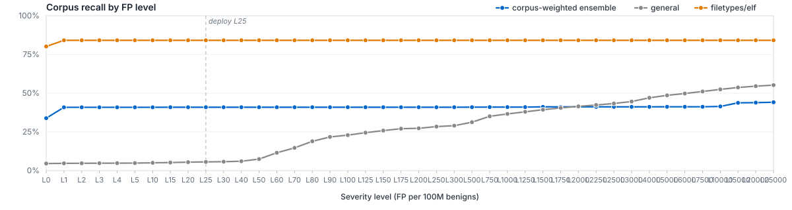

# Azoth

Static malware detection by routed ensemble. A general LightGBM model scores every file. Per-filetype specialists score files in their domain — PE, ELF, JavaScript, PDF, and 63 more. A file is flagged when any route's score crosses its operating-point threshold.

The point of routing is that the evidence differs by format. A PE's section table is signal. A PDF's stream dictionary is signal. A shell script's token distribution is signal. One generalist trained over all of them learns averages; a specialist trained on one of them learns the format.

Thresholds were fit on a 2,645,885-row dev partition (12.5% of the labeled corpus). The numbers in this README come from a locked 2,646,643-row test partition, disjoint from training and calibration. The bundle is loaded at scan time by [Atomdrift Scan](https://github.com/atomdrift-project/scan). EMBER 2024 reference: Joyce et al., *KDD'25*.

## Use

Input is a JSON report produced by `cleave`. Output is one verdict — `benign` or `hostile` — qualified by a severity level L0..L25000. Scan reads the hostile threshold at the chosen level (consumers can label anything firing above the configured critical level as suspicious if they want a softer tier); the deployed default is L25 (0.25 FP/M). Lower levels tighten the operating point; higher levels loosen it.

## Bundle layout

`config.json` records the deployed thresholds. Each route lives in its own subdirectory: `general/`, one of 8 `filegroups/<name>/`, or one of 67 `filetypes/<name>/`. A route directory carries a `models/seed_*.onnx` ensemble (LightGBM trees exported to ONNX, one file per training seed) and `feature_spec.json` (the features those models expect). Scores are the models' raw probabilities — there is no separate probability calibrator.

Further reading: [ENSEMBLE_MODEL.md](ENSEMBLE_MODEL.md) for routing details, [GENERALIST_MODEL.md](GENERALIST_MODEL.md) for the single-model baseline. License: Apache 2.0.

## Per-filetype Ensemble Performance

Each row reports the frozen routing policy on the locked test partition. PR AUC and ROC AUC rank signed policy margins; F1 and recall measure actual decisions at L25 (0.25 FP/M). Observed false-positive rates can differ from the dev calibration target.

A filetype appears here when it has at least 25 malware and 25 benign in the test slice, or at least 100 of each across the full labeled corpus. Pure archive wrappers (zip, tar, gz, …), `data`, and `unknown` are excluded — their score reflects the container's shape, not the classifier's quality.

**Selection and reporting.** Models train on train; thresholds and routing policies are selected on dev using the exported production ensembles. Test measures those saved decisions. An ensemble can perform worse than a specialist on test; the report preserves that result.

| File type | Test mal / ben | PR AUC | ROC AUC | F1 | Recall @ L25 | FP @ L25 | Δ vs EMBER 2024 |
|---|---:|---:|---:|---:|---:|---:|---:|
| [`rtf`](filetypes/rtf/README.md) | 810 / 115 | 1.000000 | 1.000000 | 0.996904 | 99.38% | 0 | — |
| [`elf`](filetypes/elf/README.md) | 24,968 / 113,453 | — | — | 0.980295 | 96.14% | 1 | — |
| [`ole_doc`](filetypes/ole_doc/README.md) | 11,041 / 4,150 | 0.994489 | 0.984096 | 0.946625 | 89.87% | 1 | — |
| [`python_sdist`](filetypes/python_sdist/README.md) | 370 / 1,527 | 0.932616 | 0.925020 | 0.935622 | 88.38% | 2 | — |
| [`gem`](filetypes/gem/README.md) | 51 / 14,892 | — | — | 0.937500 | 88.24% | 0 | — |
| [`7z`](filetypes/7z/README.md) | 1,125 / 49 | 0.997898 | 0.952417 | 0.908826 | 83.29% | 0 | — |
| [`registry`](filetypes/registry/README.md) | 59 / 13,680 | 0.935687 | 0.999210 | 0.876190 | 77.97% | 0 | — |
| [`jar`](filetypes/jar/README.md) | 470 / 5,247 | 0.970395 | 0.995145 | 0.860241 | 75.96% | 3 | — |
| [`pdf`](filetypes/pdf/README.md) | 22,480 / 3,773 | 0.993010 | 0.963585 | 0.855638 | 74.79% | 5 | PR -0.000290 / ROC -0.027615 |
| [`perl`](filetypes/perl/README.md) | 55 / 10,179 | 0.906036 | 0.992943 | 0.854167 | 74.55% | 0 | — |
| [`apk_android`](filetypes/apk_android/README.md) | 503 / 121 | 0.954056 | 0.836001 | 0.832383 | 72.56% | 9 | — |
| [`npm`](filetypes/npm/README.md) | 3,629 / 42,307 | — | — | 0.839936 | 72.44% | 2 | — |
| [`macho`](filetypes/macho/README.md) | 325 / 4,792 | 0.909535 | 0.980329 | 0.820423 | 71.69% | 10 | — |
| [`package.json`](filetypes/package.json/README.md) | 2,672 / 9,664 | 0.978912 | 0.985038 | 0.817176 | 69.09% | 0 | — |
| [`php`](filetypes/php/README.md) | 764 / 78,540 | 0.849734 | 0.961880 | 0.804669 | 67.67% | 4 | — |
| [`html`](filetypes/html/README.md) | 11,516 / 54,237 | 0.978906 | 0.991015 | 0.803719 | 67.18% | 0 | — |
| [`lnk`](filetypes/lnk/README.md) | 585 / 153 | 0.996282 | 0.987017 | 0.803681 | 67.18% | 0 | — |
| [`python_bytecode`](filetypes/python_bytecode/README.md) | 403 / 154,295 | 0.703580 | 0.875728 | 0.768293 | 62.53% | 1 | — |
| [`tar`](filetypes/tar/README.md) | 1,912 / 13,066 | 0.941336 | 0.974339 | 0.748611 | 59.88% | 2 | — |
| [`ruby`](filetypes/ruby/README.md) | 32 / 24,725 | 0.741094 | 0.945843 | 0.703704 | 59.38% | 3 | — |
| [`powershell`](filetypes/powershell/README.md) | 776 / 792 | 0.980763 | 0.975813 | 0.737185 | 58.38% | 0 | — |
| [`ico`](filetypes/ico/README.md) | 33 / 99 | 0.681818 | 0.785736 | 0.730769 | 57.58% | 0 | — |
| [`kotlin`](filetypes/kotlin/README.md) | 3,161 / 10,647 | 0.706845 | 0.807676 | 0.726430 | 57.04% | 0 | — |
| [`pkg_info`](filetypes/pkg_info/README.md) | 30 / 2,355 | 0.885936 | 0.964529 | 0.708333 | 56.67% | 1 | — |
| [`python`](filetypes/python/README.md) | 2,634 / 84,912 | 0.831747 | 0.936723 | 0.682671 | 51.82% | 0 | — |
| [`shell`](filetypes/shell/README.md) | 2,445 / 21,600 | 0.948472 | 0.973721 | 0.679449 | 51.45% | 0 | — |
| [`zip`](filetypes/zip/README.md) | 13,595 / 18,598 | 0.854095 | 0.795638 | 0.675693 | 51.03% | 1 | — |
| [`rust`](filetypes/rust/README.md) | 55 / 45,700 | — | — | 0.439024 | 49.09% | 41 | — |
| [`javascript`](filetypes/javascript/README.md) | 18,084 / 227,412 | 0.886481 | 0.961918 | 0.649903 | 48.16% | 10 | — |
| [`vbs`](filetypes/vbs/README.md) | 1,858 / 546 | 0.990829 | 0.971439 | 0.636863 | 46.77% | 2 | — |
| [`java`](filetypes/java/README.md) | 414 / 25,208 | — | — | 0.623165 | 46.14% | 8 | — |
| [`json`](filetypes/json/README.md) | 33 / 39,064 | — | — | 0.625000 | 45.45% | 0 | — |
| [`static-lib`](filetypes/static-lib/README.md) | 72 / 1,613 | 0.875802 | 0.982861 | 0.584906 | 43.06% | 3 | — |
| [`crx`](filetypes/crx/README.md) | 306 / 1,545 | — | — | 0.570093 | 39.87% | 0 | — |
| [`pe`](filetypes/pe/README.md) | 204,120 / 33,839 | 0.994215 | 0.965998 | 0.562973 | 39.18% | 1 | PR -0.004085 / ROC -0.032202 |
| [`ooxml`](filetypes/ooxml/README.md) | 8,334 / 822 | 0.985152 | 0.888261 | 0.524024 | 35.53% | 6 | — |
| [`java_class`](filetypes/java_class/README.md) | 305 / 229,228 | 0.696471 | 0.971626 | 0.493827 | 32.79% | 0 | — |
| [`go`](filetypes/go/README.md) | 1,115 / 31,845 | 0.733330 | 0.930726 | 0.459310 | 29.87% | 2 | — |
| [`vsix`](filetypes/vsix/README.md) | 51 / 766 | 0.658859 | 0.888522 | 0.454545 | 29.41% | 0 | — |
| [`csharp`](filetypes/csharp/README.md) | 452 / 12,879 | 0.345597 | 0.797687 | 0.328413 | 19.69% | 1 | — |
| [`batch`](filetypes/batch/README.md) | 22,302 / 1,165 | 0.948856 | 0.279310 | 0.270038 | 15.61% | 5 | — |
| [`xml`](filetypes/xml/README.md) | 223 / 56,238 | 0.300489 | 0.891416 | 0.257812 | 14.80% | 0 | — |
| [`whl`](filetypes/whl/README.md) | 344 / 8,477 | — | — | 0.253807 | 14.53% | 0 | — |
| [`jpeg`](filetypes/jpeg/README.md) | 194 / 5,650 | 0.271651 | 0.800151 | 0.134615 | 7.22% | 0 | — |
| [`c`](filetypes/c/README.md) | 2,122 / 221,789 | 0.287021 | 0.746079 | 0.132864 | 7.12% | 0 | — |
| [`png`](filetypes/png/README.md) | 983 / 68,306 | 0.075268 | 0.530863 | 0.111431 | 5.90% | 0 | — |
| [`text`](filetypes/text/README.md) | 813 / 61,568 | 0.184345 | 0.878591 | 0.106977 | 5.66% | 1 | — |
| [`gif`](filetypes/gif/README.md) | 85 / 222 | 0.586619 | 0.828193 | 0.045455 | 2.35% | 1 | — |
| **Weighted avg** (by test pop) | **2,130,559** | — | — | **0.5673** | **44.6%** | **126 total** | — |

L25 decisions and F1 are updated from the committed [test evaluation](route_policy_eval_oof.json). Signed-policy-margin PR AUC and ROC AUC were not regenerated for the 14 updated specialists; those cells, their EMBER deltas, and the aggregate AUCs are marked —. Unchanged routes retain their previous AUC results. See [SPECIALIST_UPDATE.md](SPECIALIST_UPDATE.md) for all 14 updates, including filetypes outside this table, and [global policy metrics](global_policy_metrics.md) for current results across FP levels.

PR AUC summarizes recall against precision across operating points. Recall@L25 is the selection-budget headline; for filetypes whose calibration slice cannot resolve L25 (0.25 FP/M) empirically, that level shares an operating point with its neighbours (its measured ceiling). EMBER 2024 deltas are reported where Joyce et al. publish per-filetype numbers (Table 5, All files → X).

## Recall by FP level (per 100M benigns)

The chart below is the pre-update baseline; current results are in [global policy metrics](global_policy_metrics.md).

The corpus-weighted ensemble curve weights each filetype's ensemble recall by the number of labeled files in that filetype, answering: "If I draw a random file from the labeled corpus, what fraction of malware do we catch at this FP budget?" The general curve is the single-model baseline on the full evaluated dataset. filetypes/elf is shown for comparison — a single strong route that resolves across levels, so the corpus-weighted line (dominated by large, near-flat routes like pe) can be read against it. The vertical dashed line marks the L25 deploy operating point.

## Provenance

Calibration snapshot `6309383805`, score-table `ca4de08843d6`, model-set `6e2c7016118a`. 1 general, 8 filegroup, 67 filetype routes.

## Limits

- Strict L0..L25 (FP/100M) targets can sit below the calibration benign volume's resolution (the finest non-zero rate is 1 FP / N_benign); below that, adjacent levels share one measured-ceiling operating point. Thresholds are measured (loosest score within the level's FP budget +1 slack), not extrapolated — they can't overshoot on live traffic. More benigns sharpen the low levels.
- The split is content-deduplicated by `canonical_sha256`, not family-aware. Campaign-level generalization may be overstated.
- Deployment distribution may differ from the training corpus.

## Sources

[MalwareBazaar](https://bazaar.abuse.ch/), [VirusShare](https://virusshare.com/), [Backstabber's Knife Collection](https://dasfreak.github.io/Backstabbers-Knife-Collection/), [DataDog malicious-software-packages-dataset](https://github.com/DataDog/malicious-software-packages-dataset), [VX Underground](https://vx-underground.org/), [PyPI MalRegistry](https://github.com/lxyeternal/pypi_malregistry), [Linux Malware Samples](https://github.com/MalwareSamples/Linux-Malware-Samples), [Tim (Wadhwa-)Brown's Linux Malware Repo](https://github.com/timb-machine/linux-malware), [Javascript Malware Collection](https://github.com/HynekPetrak/javascript-malware-collection), [ObjectiveSee macOS Malware Collection](https://github.com/objective-see/Malware), [Practical Security Analytics PE Malware ML Dataset](https://practicalsecurityanalytics.com/pe-malware-machine-learning-dataset/), [Ultimate RAT Collection](https://github.com/Cryakl/Ultimate-RAT-Collection).
