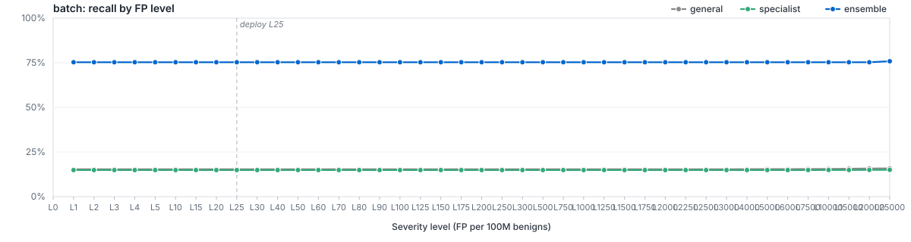

# `filetype/batch`

LightGBM specialist for `batch`. Member of the Azoth routed ensemble; bundle root: [../..](../..).

## Ensemble Performance

Routed ensemble (general + filegroup + filetype where applicable) on the `batch` slice of the locked test partition: 22,302 malware / 1,165 benign (23,467 rows).

| PR AUC | ROC AUC | F1 | Recall @ L25 | Brier |
|---:|---:|---:|---:|---:|
| 0.948856 | 0.279310 | 0.270038 | 15.61% | - |

## Specialist Performance

`filetypes/batch` specialist scored alone on the same held-out slice, using its saved thresholds.

| PR AUC | ROC AUC | F1 | Recall @ L25 | Brier | Δ vs EMBER 2024 |
|---:|---:|---:|---:|---:|---:|
| 0.992376 | 0.865955 | 0.255660 | 14.66% | 0.7795 | — |

## Recall by FP level (per 100M benigns)

Each curve plots recall at the per-100M-benign FP target for the route. The vertical dashed line marks the L25 deploy operating point.

## Routing

Files matching `batch` are scored by `filegroups/scripts`, `filetypes/batch`, `general`. The ensemble's decisions apply the saved routing policy, including every level at or below the requested level. Ranking metrics use the signed distance from that policy's decision boundary. See [`route_policies.md`](../../route_policies.md).

## Training

| Parameter | Value |
|---|---:|
| Algorithm | LightGBM binary classifier |
| Train rows | 30,832 (23,882 mal / 6,950 ben) |
| Feature spec | 8746 features (`route_specific`) |
| n_estimators | 400 |
| num_leaves | 96 |
| max_depth | 12 |
| min_child_samples | 100 |
| learning_rate | 0.05 |
| subsample / colsample | 0.8 / 0.8 |
| reg_alpha / reg_lambda | 0.0 / 1.0 |
| early_stopping_rounds | 25 |
| device | auto |
