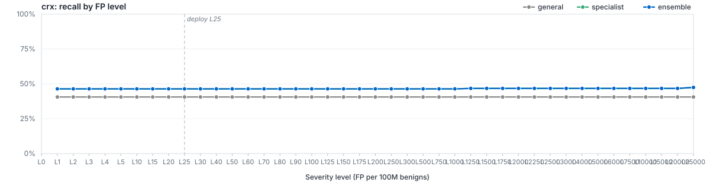

# `filetype/crx`

LightGBM specialist for `crx`. Member of the Azoth routed ensemble; bundle root: [../..](../..).

## Ensemble Performance

Routed ensemble (general + filegroup + filetype where applicable) on the `crx` slice of the locked test partition: 293 malware / 769 benign (1,062 rows).

| PR AUC | ROC AUC | F1 | Recall @ L25 | Brier |
|---:|---:|---:|---:|---:|
| 0.945050 | 0.964131 | 0.885077 | 54.27% | 0.0507 |

## Specialist Performance

`filetypes/crx` specialist scored *alone* on the same slice (the ensemble usually does better — that's the point of the routing).

| PR AUC | ROC AUC | F1 | Recall @ L25 | Brier | Δ vs EMBER 2024 |
|---:|---:|---:|---:|---:|---:|
| 0.946711 | 0.963773 | 0.881119 | 50.17% | 0.0530 | — |

## Recall by FP level (per 100M benigns)

Each curve plots recall at the per-100M-benign FP target for the route. The vertical dashed line marks the L25 deploy operating point.

## Routing

Files matching `crx` are scored by `general`, `filetypes/crx`. The ensemble's per-row score is whatever combiner strategy (`stacked_lr`) the metrics step selected for this route. The per-level operating thresholds litmus applies on top live in [`route_policies.md`](../../route_policies.md).

## Training

| Parameter | Value |
|---|---:|
| Algorithm | LightGBM binary classifier |
| Train rows | 6,648 (1,177 mal / 5,471 ben) |
| Feature spec | 1554 features (`route_specific`) |
| n_estimators | 400 |
| num_leaves | 128 |
| max_depth | 12 |
| min_child_samples | 100 |
| learning_rate | 0.05 |
| subsample / colsample | 0.8 / 0.8 |
| reg_alpha / reg_lambda | 0.0 / 1.0 |
| early_stopping_rounds | 25 |
| device | auto |
