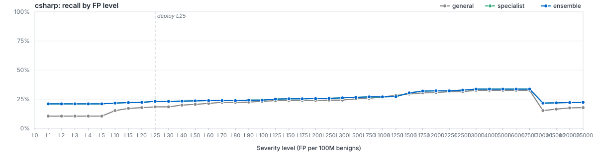

# `filetype/csharp`

LightGBM specialist for `csharp`. Member of the Azoth routed ensemble; bundle root: [../..](../..).

## Ensemble Performance

Routed ensemble (general + filegroup + filetype where applicable) on the `csharp` slice of the locked test partition: 471 malware / 12,851 benign (13,322 rows).

| PR AUC | ROC AUC | F1 | Recall @ L25 | Brier |
|---:|---:|---:|---:|---:|
| 0.311688 | 0.693680 | 0.383117 | 18.26% | 0.0275 |

## Specialist Performance

`filetypes/csharp` specialist scored *alone* on the same slice (the ensemble usually does better — that's the point of the routing).

| PR AUC | ROC AUC | F1 | Recall @ L25 | Brier | Δ vs EMBER 2024 |
|---:|---:|---:|---:|---:|---:|
| 0.321247 | 0.669018 | 0.393388 | 17.62% | 0.0272 | — |

## Recall by FP level (per 100M benigns)

Each curve plots recall at the per-100M-benign FP target for the route. The vertical dashed line marks the L25 deploy operating point.

## Routing

Files matching `csharp` are scored by `general`, `filegroups/source`, `filetypes/csharp`. The ensemble's per-row score is whatever combiner strategy (`calibrated_max`) the metrics step selected for this route. The per-level operating thresholds litmus applies on top live in [`route_policies.md`](../../route_policies.md).

## Training

| Parameter | Value |
|---|---:|
| Algorithm | LightGBM binary classifier |
| Train rows | 90,671 (836 mal / 89,835 ben) |
| Feature spec | 1434 features (`route_specific`) |
| n_estimators | 400 |
| num_leaves | 96 |
| max_depth | 12 |
| min_child_samples | 100 |
| learning_rate | 0.05 |
| subsample / colsample | 0.8 / 0.8 |
| reg_alpha / reg_lambda | 0.0 / 1.0 |
| early_stopping_rounds | 25 |
| device | auto |
