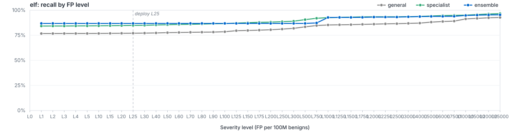

# `filetype/elf`

LightGBM specialist for `elf`. Member of the Azoth routed ensemble; bundle root: [../..](../..).

## Ensemble Performance

Routed ensemble (general + filegroup + filetype where applicable) on the `elf` slice of the locked test partition: 24,968 malware / 113,453 benign (138,421 rows).

| PR AUC | ROC AUC | F1 | Recall @ L25 | Brier |
|---:|---:|---:|---:|---:|
| 0.995704 | 0.998512 | 0.914010 | 84.16% | - |

## Specialist Performance

`filetypes/elf` specialist scored alone on the same held-out slice, using its saved thresholds.

| PR AUC | ROC AUC | F1 | Recall @ L25 | Brier | Δ vs EMBER 2024 |
|---:|---:|---:|---:|---:|---:|
| 0.991193 | 0.998165 | 0.023120 | 1.17% | 0.0193 | PR -0.002107 / ROC +0.004865 |

## Recall by FP level (per 100M benigns)

Each curve plots recall at the per-100M-benign FP target for the route. The vertical dashed line marks the L25 deploy operating point.

## Routing

Files matching `elf` are scored by `filegroups/native`, `filetypes/elf`, `general`. The ensemble's decisions apply the saved routing policy, including every level at or below the requested level. Ranking metrics use the signed distance from that policy's decision boundary. See [`route_policies.md`](../../route_policies.md).

## Training

| Parameter | Value |
|---|---:|
| Algorithm | LightGBM binary classifier |
| Train rows | 830,284 (147,836 mal / 682,448 ben) |
| Feature spec | 32717 features (`route_specific`) |
| n_estimators | 400 |
| num_leaves | 96 |
| max_depth | 12 |
| min_child_samples | 100 |
| learning_rate | 0.05 |
| subsample / colsample | 0.8 / 0.8 |
| reg_alpha / reg_lambda | 0.0 / 1.0 |
| early_stopping_rounds | 25 |
| device | auto |
