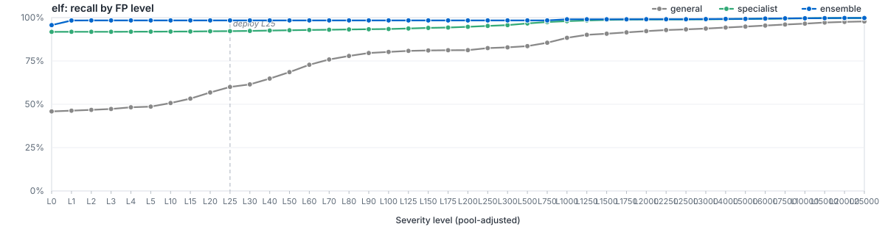

# `filetype/elf`

LightGBM specialist for `elf`. Member of the Azoth routed ensemble; bundle root: [../..](../..).

Level labels use the [shared pool-adjusted FP allowance](https://github.com/atomdrift-project/collimator/blob/main/LEVELS.md): L0 allows zero observed calibration FPs; L1 allows one; L25 adds an estimated 24 FP/100M beyond the initial FP.

## Ensemble Performance

Routed ensemble (general + filegroup + filetype where applicable) on the `elf` slice of the locked test partition: 24,970 malware / 113,467 benign (138,437 rows).

| PR AUC | ROC AUC | F1 | Recall @ L25 | Brier |
|---:|---:|---:|---:|---:|
| 0.999777 | 0.999931 | 0.991582 | 98.36% | - |

## Specialist Performance

`filetypes/elf` specialist scored alone on the same held-out slice, using its saved thresholds.

| PR AUC | ROC AUC | F1 | Recall @ L25 | Brier | Δ vs EMBER 2024 |
|---:|---:|---:|---:|---:|---:|
| 0.999900 | 0.999979 | 0.957351 | 91.83% | 0.0007 | PR +0.006600 / ROC +0.006679 |

## Recall by FP level (pool-adjusted)

Each curve plots recall at the route's pool-adjusted FP level. L0 allows zero observed calibration FPs; positive L allows `1 + (L - 1) * N / 100_000_000` for N benigns. See the [shared level definition](https://github.com/atomdrift-project/collimator/blob/main/LEVELS.md). The vertical dashed line marks the L25 deploy operating point.

## Routing

Files matching `elf` are scored by `filegroups/historical_filetypes_elf_frozen`, `filegroups/native`, `filetypes/elf`, `general`. The ensemble's decisions apply the saved routing policy, including every level at or below the requested level. Ranking metrics use the signed distance from that policy's decision boundary. See [`route_policies.md`](../../route_policies.md).

## Training

| Parameter | Value |
|---|---:|
| Algorithm | LightGBM binary classifier |
| Train rows | 831,634 (149,012 mal / 682,622 ben) |
| Feature spec | 32795 features (`route_specific`) |
| n_estimators | 400 |
| num_leaves | 96 |
| max_depth | 12 |
| min_child_samples | 100 |
| learning_rate | 0.05 |
| subsample / colsample | 0.8 / 0.8 |
| reg_alpha / reg_lambda | 0.0 / 1.0 |
| early_stopping_rounds | 25 |
| device | cpu |
