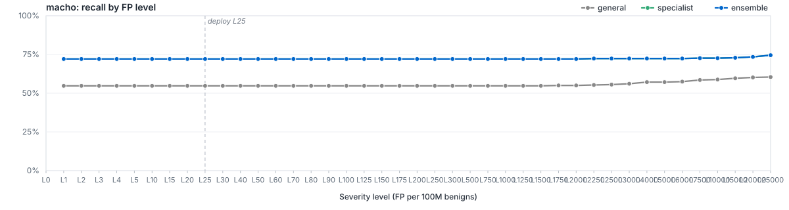

# `filetype/macho`

LightGBM specialist for `macho`. Member of the Azoth routed ensemble; bundle root: [../..](../..).

## Ensemble Performance

Routed ensemble (general + filegroup + filetype where applicable) on the `macho` slice of the locked test partition: 326 malware / 1,462 benign (1,788 rows).

| PR AUC | ROC AUC | F1 | Recall @ L4 | Brier |
|---:|---:|---:|---:|---:|
| 0.986217 | 0.995999 | 0.943750 | 81.60% | 0.0162 |

## Specialist Performance

`filetypes/macho` specialist scored *alone* on the same slice (the ensemble usually does better — that's the point of the routing).

| PR AUC | ROC AUC | F1 | Recall @ L4 | Brier | Δ vs EMBER 2024 |
|---:|---:|---:|---:|---:|---:|
| 0.986217 | 0.995999 | 0.943750 | 81.60% | 0.0162 | — |

## Recall by FP level (per 100M benigns)

Each curve plots recall at the per-100M-benign FP target for the route. The vertical dashed line marks the L4 deploy operating point.

## Routing

Files matching `macho` are scored by `general`, `filegroups/native`, `filetypes/macho`. The ensemble's per-row score is whatever combiner strategy (`specialist_priority`) the metrics step selected for this route. The per-level operating thresholds litmus applies on top live in [`route_policies.md`](../../route_policies.md).

## Training

| Parameter | Value |
|---|---:|
| Algorithm | LightGBM binary classifier |
| Train rows | 12,105 (2,192 mal / 9,913 ben) |
| Feature spec | 76116 features (`general_shared`) |
| n_estimators | 400 |
| num_leaves | 96 |
| max_depth | 12 |
| min_child_samples | 100 |
| learning_rate | 0.05 |
| subsample / colsample | 0.8 / 0.8 |
| reg_alpha / reg_lambda | 0.0 / 1.0 |
| early_stopping_rounds | 50 |
| device | auto |
