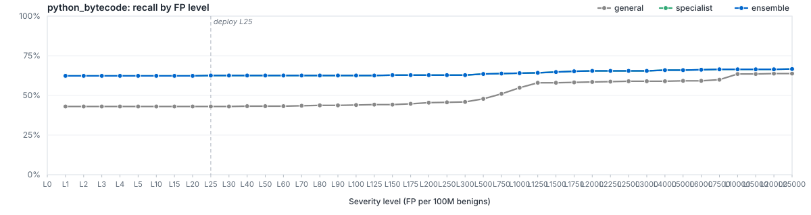

# `filetype/python_bytecode`

LightGBM specialist for `pyc`, `python-bytecode`, `python_bytecode`. Member of the Azoth routed ensemble; bundle root: [../..](../..).

## Ensemble Performance

Routed ensemble (general + filegroup + filetype where applicable) on the `python_bytecode` slice of the locked test partition: 403 malware / 154,295 benign (154,698 rows).

| PR AUC | ROC AUC | F1 | Recall @ L25 | Brier |
|---:|---:|---:|---:|---:|
| 0.703580 | 0.875728 | 0.768293 | 62.53% | - |

## Specialist Performance

`filetypes/python_bytecode` specialist scored alone on the same held-out slice, using its saved thresholds.

| PR AUC | ROC AUC | F1 | Recall @ L25 | Brier | Δ vs EMBER 2024 |
|---:|---:|---:|---:|---:|---:|
| 0.700618 | 0.832660 | 0.768293 | 62.53% | 0.0013 | — |

## Recall by FP level (per 100M benigns)

Each curve plots recall at the per-100M-benign FP target for the route. The vertical dashed line marks the L25 deploy operating point.

## Routing

Files matching `python_bytecode` are scored by `filegroups/portable`, `filetypes/python_bytecode`, `general`. The ensemble's decisions apply the saved routing policy, including every level at or below the requested level. Ranking metrics use the signed distance from that policy's decision boundary. See [`route_policies.md`](../../route_policies.md).

## Training

| Parameter | Value |
|---|---:|
| Algorithm | LightGBM binary classifier |
| Train rows | 930,405 (1,599 mal / 928,806 ben) |
| Feature spec | 6444 features (`route_specific`) |
| n_estimators | 300 |
| num_leaves | 128 |
| max_depth | 12 |
| min_child_samples | 150 |
| learning_rate | 0.03 |
| subsample / colsample | 0.8 / 0.8 |
| reg_alpha / reg_lambda | 0.0 / 2.0 |
| early_stopping_rounds | 25 |
| device | auto |
