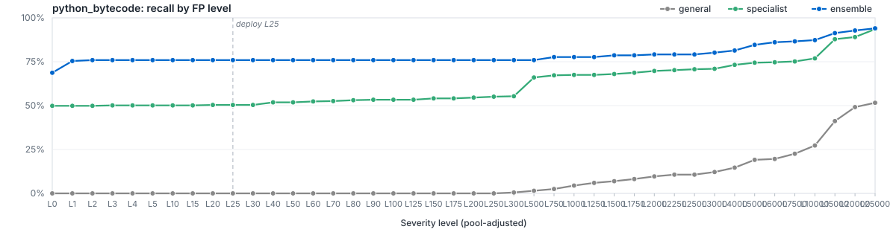

# `filetype/python_bytecode`

LightGBM specialist for `pyc`, `python-bytecode`, `python_bytecode`. Member of the Azoth routed ensemble; bundle root: [../..](../..).

Level labels use the [shared pool-adjusted FP allowance](https://github.com/atomdrift-project/collimator/blob/main/LEVELS.md): L0 allows zero observed calibration FPs; L1 allows one; L25 adds an estimated 24 FP/100M beyond the initial FP.

## Ensemble Performance

Routed ensemble (general + filegroup + filetype where applicable) on the `python_bytecode` slice of the locked test partition: 403 malware / 154,301 benign (154,704 rows).

| PR AUC | ROC AUC | F1 | Recall @ L25 | Brier |
|---:|---:|---:|---:|---:|
| 0.950086 | 0.999770 | 0.825613 | 75.19% | - |

## Specialist Performance

`filetypes/python_bytecode` specialist scored alone on the same held-out slice, using its saved thresholds.

| PR AUC | ROC AUC | F1 | Recall @ L25 | Brier | Δ vs EMBER 2024 |
|---:|---:|---:|---:|---:|---:|
| 0.935353 | 0.999699 | 0.738872 | 61.79% | 0.0006 | — |

## Recall by FP level (pool-adjusted)

Each curve plots recall at the route's pool-adjusted FP level. L0 allows zero observed calibration FPs; positive L allows `1 + (L - 1) * N / 100_000_000` for N benigns. See the [shared level definition](https://github.com/atomdrift-project/collimator/blob/main/LEVELS.md). The vertical dashed line marks the L25 deploy operating point.

## Routing

Files matching `python_bytecode` are scored by `filegroups/portable`, `filetypes/python_bytecode`, `general`. The ensemble's decisions apply the saved routing policy, including every level at or below the requested level. Ranking metrics use the signed distance from that policy's decision boundary. See [`route_policies.md`](../../route_policies.md).

## Training

| Parameter | Value |
|---|---:|
| Algorithm | LightGBM binary classifier |
| Train rows | 931,386 (2,533 mal / 928,853 ben) |
| Feature spec | 12037 features (`route_specific`) |
| n_estimators | 250 |
| num_leaves | 96 |
| max_depth | 12 |
| min_child_samples | 50 |
| learning_rate | 0.05 |
| subsample / colsample | 0.8 / 0.8 |
| reg_alpha / reg_lambda | 0 / 1 |
| early_stopping_rounds | 25 |
| device | auto |
